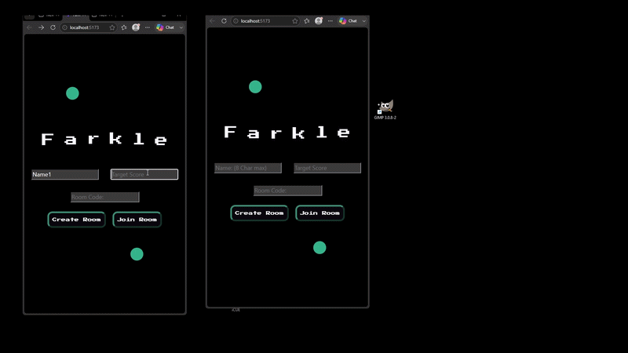

# Farkle Online Multiplayer

A real-time multiplayer implementation of the classic Farkle dice game built with React and WebSockets. Players can create or join rooms, roll dice, manage scores, and compete against other players with synchronized game state across clients.

## Demo
<div align="center">
  
</div>

## Features

- Real-time multiplayer gameplay using WebSockets
- Room-code based matchmaking
- Live player score synchronization
- Animated dice interactions
- Custom SVG-based graphics and effects
- Procedural WebGL shader background effects
- Responsive layout optimized for desktop and mobile browsers
- Cross-device support (tested on Android and iOS Safari)

## Tech Stack


### Frontend
- React
- JavaScript
- CSS
- WebGL / GLSL shaders
- SVG animations

### Networking
- Socket.io
- WebSocket communication

### Backend
- Node.js
- Express

## Architecture

The application uses a client-server architecture:

- Clients handle rendering, animations, and player input
- The server manages authoritative game state
- WebSocket events synchronize player actions in real time

Example events:
- Player joins room
- Starts Game
- Dice rolled
- Button Sync
- Bust System
- Score updated
- Turn changed
- Round completed

## Challenges
Android to iOs styling
State Synchronization
Shader Value Noise Function implmentation
Dice Animation
Sin Text Animatoin

### Real-Time State Synchronization
Designed a system to keep multiple players synchronized while handling:
- player turns
- dice state
- score updates
- room management

### Responsive Game Scaling
Implemented a fixed game coordinate system with dynamic scaling to maintain consistent gameplay across different screen sizes and devices.

### Custom Graphics
Created animated SVG components and GLSL shader effects for a unique visual style.

## Installation

```bash
git clone <(https://github.com/devB333/FarkleClient)>
cd farkle-client
npm install
npm run dev
